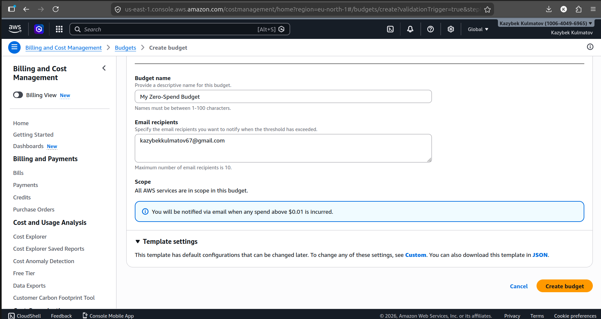
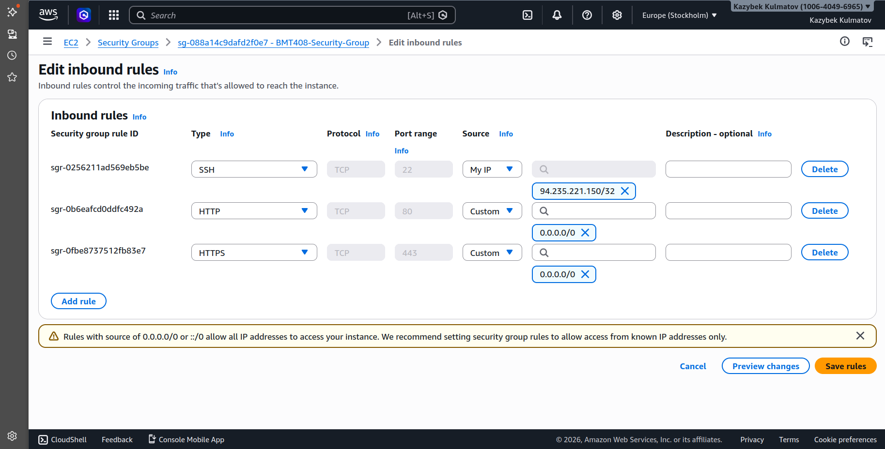
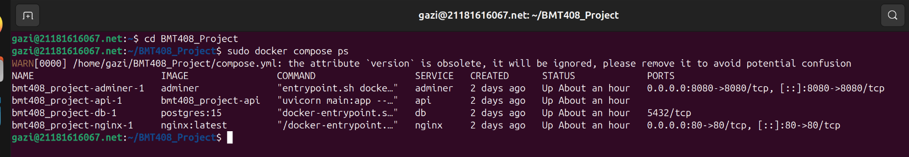
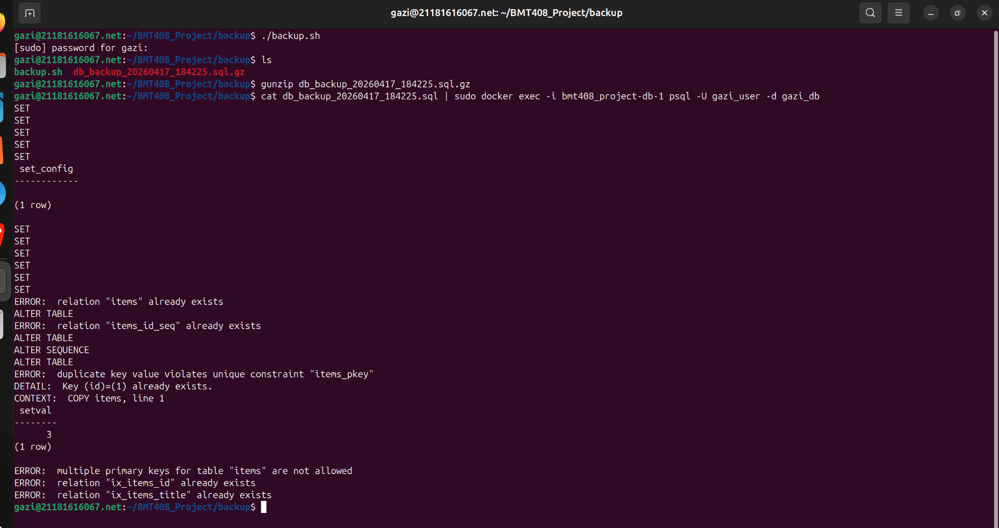

# BMT-408 Proje Kanıt Dosyaları

### 1. Sıfır Bütçe (AWS Free Tier) Kanıtı

### 2. AWS Security Group (Sadece Öğrenci IP İzni)

### 3. Docker Konteynerlerinin Çalışma Durumu

### 4. FastAPI Swagger UI Ekranı

### 5. Nftables Firewall ve Açık Portlar (ss -tulpn)

### 6. Veritabanı Yedekleme ve Geri Yükleme Testi

